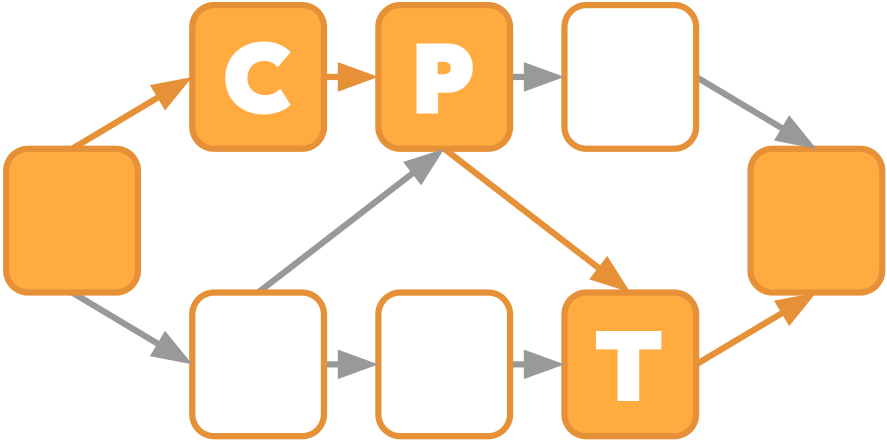

# On-the-fly Critical-Path Tool (CPT)


Tool to collect and report model factors (aka. fundamental performance factors) for OpenMP tasking applications on-the-fly.

## Building with CMake
### Basic Cmake
```
mkdir BUILD
cd BUILD
cmake ../
make -j8
```

By default, the tool is built to support 1 integer and 15 double dependent metric values. To change these values, pass the following variables to cmake:
```
cmake ../ -DNUM_DEP_INT_METRICS=<num_int_metrics> -DNUM_DEP_DBL_METRICS=<num_dbl_metrics>
```
Passing zero to both will disable the support for dependent metrics completely.

### Building with Clang
```
mkdir BUILD
cd BUILD
CC=clang CXX=clang++ cmake ../
make -j8
```
The respective clang version needs to have the libomp-*-dev packet installed.

### Using libc++ with Clang-based compilers
If GNU C++ headers are available, they are preferred for building CPT (which is also the default).
If no GNU C++ headers are available, CPT can be built by explicitly using
LLVM's C++ runtime library (libc++) by configuring CPT with the cmake
flag `-DCPT_USE_LLVM_LIBCPP=ON`.


## Using the tool with an application
Assuming a cmake build as described above, an application with CPT is executed like:
```
OMP_NUM_THREADS=4 OMP_TOOL_LIBRARIES=./BUILD/libCPT.so ./app
```

At the moment, the tool supports selective instrumentation with a single pair of start/stop markers:
```
omp_control_tool(omp_control_tool_start, 0, NULL); // start
// region of interest
omp_control_tool(omp_control_tool_end, 0, NULL); // stop
```

In both cases the runtime option `stopped=1` should be used, see below.

### Runtime options
The behavior of CPT can be changed with different runtime options. All
runtime options are exported as a space separated string assigned to
`CPT_OPTIONS`. For a full list of runtime options refer to the `help` option.

E.g.:
```
export CPT_OPTIONS="verbose=1 stopped=1 help=1"
```

<table border="2" cellspacing="0" cellpadding="6" rules="groups" frame="hsides">


<colgroup>
<col  class="org-left" />

<col  class="org-right" />

<col  class="org-left" />
</colgroup>
<thead>
<tr>
<th scope="col" class="org-left">Flag Name</th>
<th scope="col" class="org-right">Default value</th>
<th scope="col" class="org-left">Description</th>
</tr>
</thead>

<tbody>
<tr>
<td class="org-left">stopped</td>
<td class="org-right">0</td>
<td class="org-left">Delay the start of measurement until a start marker is
encountered.</td>
</tr>
</tbody>

<tbody>
<tr>
<td class="org-left">data_path</td>
<td class="org-right">stdout</td>
<td class="org-left">Write metric data to "&lt;data_path&gt;-&lt;#procs&gt;x&lt;#threads&gt;.txt". Special values are "stdout" and "stderr". Overwrites the file without checking.</td>
</tr>
</tbody>

<tbody>
<tr>
<td class="org-left">log_path</td>
<td class="org-right">stdout</td>
<td class="org-left">Write logging output to "&lt;log_path&gt;.&lt;pid&gt;". Special values are "stdout" and "stderr". Only relevant with verbose=1</td>
</tr>
</tbody>

<tbody>
<tr>
<td class="org-left">verbose</td>
<td class="org-right">0</td>
<td class="org-left">Print additional statistics.</td>
</tr>
</tbody>

<tbody>
<tr>
<td class="org-left">enable</td>
<td class="org-right">1</td>
<td class="org-left">Use CPT during execution.</td>
</tr>
</tbody>
<tbody>
<tr>
<td class="org-left">collect_task_type_share</td>
<td class="org-right">0</td>
<td class="org-left">Collect the share of task types along the critical paths.</td>
</tr>
</tbody>
<tbody>
<tr>
<td class="org-left">collect_task_counts_on_cp</td>
<td class="org-right">0</td>
<td class="org-left">Collect the number of tasks on each critical path.</td>
</tr>
</tbody>
<tbody>
<tr>
<td class="org-left">task_prio_shares</td>
<td class="org-right">""</td>
<td class="org-left">Collect the share of tasks with the specified priority values along the critical paths. Semicolon separated list, e.g.: "0;1;2". Maximum 5 priorities.</td>
</tr>
</tbody>
<tbody>
<tr>
<td class="org-left">task_name_shares</td>
<td class="org-right">""</td>
<td class="org-left">Collect the share of tasks with the specified names along the critical paths. Semicolon separated list, e.g.: "name1;name2;name3". Maximum 5 names. Requires a modified OpenMP runtime supporting task names.</td>
</tr>
</tbody>
</table>

## GNU compilers and OpenMP

To analyze OpenMP applications, the OpenMP library needs to support OMPT (which is provided by icx/clang and others, but not gcc/libgomp). To analyze applications compiled with GNU compilers, you can explicitly link the LLVM/Intel OpenMP runtime using `-lomp`/`-liomp5`

## Fortran support

Fortran support was not yet specifically tested for this tasking-version of the tool, but should generally be available.


## Files of Interest
### CPT
- critical-core.cpp     - CPT core functions
- ompt-critical.cpp     - OMPT specific code for CPT
- dependentMetrics.cpp  - Specific code for supporting dependent metrics


## Publications

- **Joachim Protze, Fabian Orland, Kingshuk Haldar, Thore Koritzius, Christian Terboven**: *On-the-Fly Calculation of Model Factors for Multi-paradigm Applications*. Euro-Par 2022
- **Joachim Jenke, Michael Knobloch, Marc-André Hermanns, Simon Schwitanski**: *A Shim Layer for Transparently Adding Meta Data to MPI Handles*. EuroMPI 2023
- **Ben Thärigen, Joachim Jenke, Alexander Optenhöfel**: *Collecting Performance Metrics Along Critical Paths in OpenMP Tasking Applications*. IWOMP 2026
